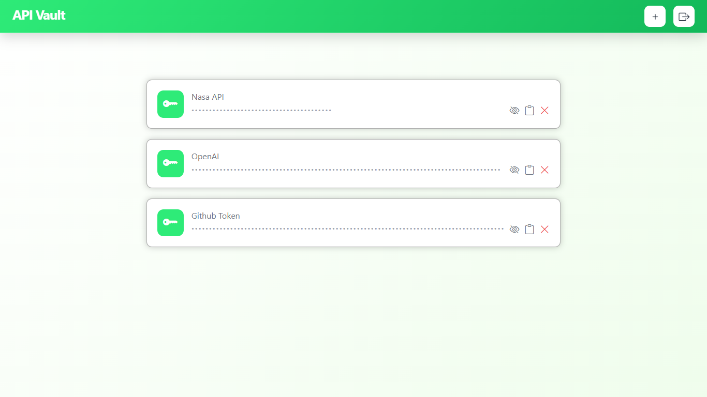
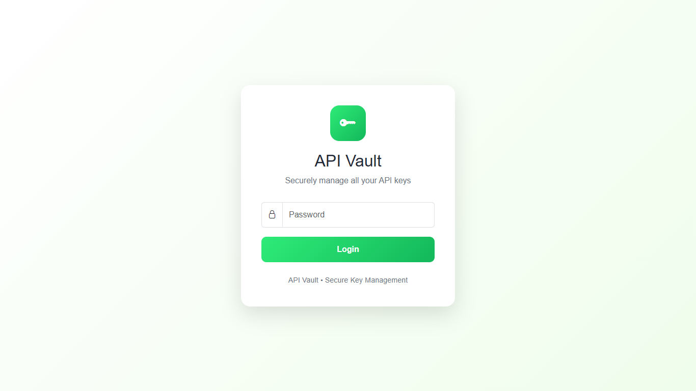

# API Vault

_**"A secure, self-hosted way to save, view, and use your API."**_

## Why ?

Secrets doesn't always get leaked by hackers. A developer can accidently commit the `.env` file, push creds to Github or save keys as plain text. As a team grows it becomes harder to manage secrets and keys. 

API Vault provides a central place where all keys can be saved securely. And developers can simply request for keys or secrets just like they do os.getenv("<key>"). Plus have an GUI interface to easily manage keys they have.

## How ?

API-vault encrypts your api-keys using the machine data. So that it can only be unlocked on the same machine. **Fernet (AES-128) based encryption**

It uses temp-tokens for authentication
which change every day. **JWT Based authentication.**


## Features:-

- JWT-based sessions
- Simple **web** dashboard
- REST API
- Fernet (AES-128) encrypted api-keys

## Project Structure

```
api-vault/
├── api/
├── core/
├── database/
├── middleware/
├── static/
├── templates/
└── app.py
```

## Project Images





## Contribution

Pull requests and suggestions are welcome. If you'd like to contribute, feel free to open an issue or submit a pull request.
